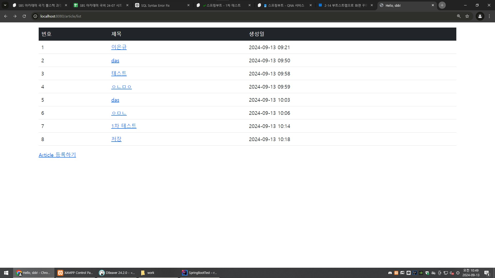
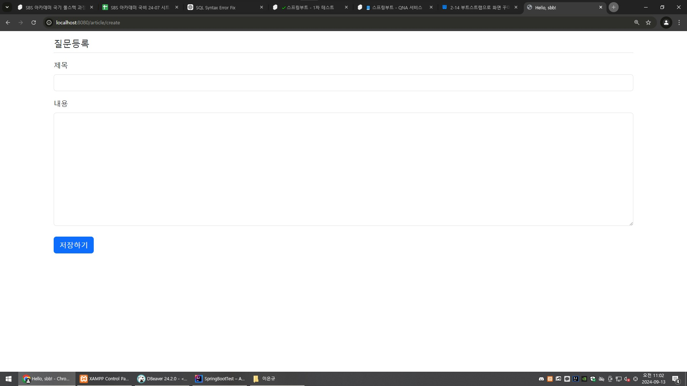
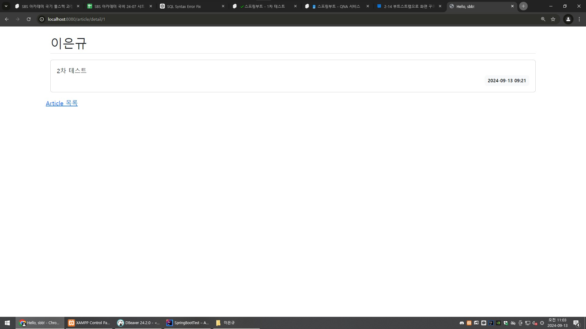

## 1차 요구사항 구현
- [O] 유저가 루트 url로 접속시에 게시글 리스트 페이지(http://주소:포트/article/list)가 나온다.
- [O] 리스트 페이지에서는 등록 버튼이 있고 버튼을 누르면 http://주소:포트/article/create 경로로 이동하고 등록 폼이 나온다.
- [O] 게시글 등록을 하면 http://주소:포트/article/create로 POST 요청을 보내어 DB에 해당 내용을 저장한다.
- [O] 게시글 등록이 되면 해당 게시글 리스트 페이지로 리다이렉트 된다. 페이지 URL 은 http://주소:포트/article/list 이다.
- [O] 리스트 페이지에서 해당 게시글을 클릭하면 상세페이지로 이동한다. 해당 경로는 http://주소:포트/article/detail/{id} 가 된다.
- [O] 게시글 상세 페이지에는 id에 맞는 게시글 데이터와 목록 버튼이 있다. 목록 버튼을 누르면 게시글 리스트 페이지로 이동하게 된다.

- (추가 기능이나 구현기능설명이 필요한 경우 서술)

## 미비사항 or 막힌 부분
- html 코드가 너무 어려워서 기본적인 버튼 만드는거 이외엔 책 보고 복사했습니다.
- html $ 을 자꾸 빼먹어서 오류가 났습니다.
- @PostMapping을 @GetMapping 으로 해서 오류가 났습니다.
- 상세 페이지 만들기 예외 처리 private static final long serialVersionUID = 1L; 이 부분 이해가 안 가서 그냥 따라 썼습니다.
- 

## UI/UX
- 게시글 리스트 페이지
- 게시글 등록 폼 페이지
- 게시글 상세 페이지
-  
## MVC 패턴
- MVC 패턴은 애플리케이션의 구조를 세가지 역할로 분리하여 관리하는 디자인 패턴입니다.
- Model: 애플리케이션의 데이터와 비즈니스 로직을 담당합니다. 데이터베이스와 상호작용하고 데이터를 가공합니다.
  View: 사용자에게 보여지는 화면을 담당합니다. HTML, JSP, Thymeleaf 등이 사용되고 모델 데이터를 시각적으로 표현합니다.
  Controller: 사용자 요청을 받아 모델과 상호작용하고 결과를 뷰에 전달하는 역할을 합니다.
- 장점: 역할 분리가 명확해서 유지보수가 쉽습니다.

## 스프링에서 의존성 주입(DI) 방법 3가지 방법
- 1.생성자 주입 : 객체생성시 생성자를 통해 의존성을 주입하는 방식입니다.
- 2.세터 주입: 의존성을 세터 메서드를 통해 주입합니다. 생성 후 의존성을 설정할 수 있으며, 선택적인 의존성 주입에 유용합니다.
- 3.필드 주입: 의존성을 직접 필드에 주입합니다. 코드가 간결하지만, 테스트하기 어려운 경우가 있고, 생성자 주입에 비해 타입 안전성이 떨어질 수 있습니다.

## JPA의 장점과 단점
- JPA의 장점
- 1.객채와 데이터베이스 매핑: 자바 객체를 데이터베이스 테이블에 자동 매핑해줍니다.
- 2.간편한 데이터 처리: 복잡한 SQL 쿼리 없이 자바 코드로 데이터를 쉽게 다룰 수 있습니다.
- 
- JPA의 단점
- 1.성능문제: ORM을 사용하면 성능이 떨어질 수 있습니다.
- 2.학습필요: 사용법을 배우는 데 시간이 걸릴 수 있습니다.
- 3.디버깅 어려움: 문제 발생 시 원인을 찾기 어려울 수 있습니다.

## HTTP GET 요청과 POST 요청의 차이
- GET요청
- 목적: 서버에서 데이터를 조회할 때 사용합니다.
- 데이터 전송: URL에 파라미터를 포함시켜 데이터를 보냅니다
- 특징:
- 1.안전: GET요청은 서버에 데이터를 조회할때 사용합니다. 이 요청은 데이터를 변경하지 않습니다. 즉,  즉, 데이터나 상태를 수정하지 않기 때문에 '안전하다'고 합니다.
- 2.캐시 가능: 한 번 로드한 웹 페이지를 다시 열 때 브라우저가 빠르게 표시할 수 있도록 페이지를 저장해 두는 것입니다. 그래서 GET 요청은 빠르고 효율적입니다.
- 3.제한된 데이터 양: URL 길이 제한이 있어 전송할 수 있는 데이터 양이 제한됩니다.
- 
- POST요청
- 목적: 서버에 데이터를 전송하거나 수정할 때 사용합니다.
- 데이터 전송: 요청 본문(body)에 데이터를 포함시켜 보냅니다(예: 사용자 정보나 파일)
- 특징:
- 1.안전하지 않음: POST 요청은 서버에 데이터를 보내거나 수정할 때 사용됩니다. 예를 들어, 회원가입할 때 사용자의 정보를 서버에 보내면, 이 정보가 데이터베이스에 저장되거나 수정됩니다. 그래서 POST 요청은 데이터베이스의 상태를 변경할 수 있으므로, '안전하지 않다'고 합니다.
- 2.캐시 불가능: 요청의 결과를 브라우저가 기억하지 않고 매번 새로 요청하게 됩니다.
- 3.큰 데이터 전송 가능: POST 요청에서는 데이터가 요청 본문(body)에 포함됩니다. 이 본문에는 길이 제한이 없어서, URL보다 훨씬 많은 양의 데이터를 서버로 보낼 수 있습니다. 예를 들어, 큰 파일이나 많은 양의 데이터를 한 번에 전송할 때 POST 요청을 사용합니다.